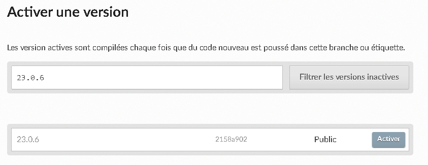
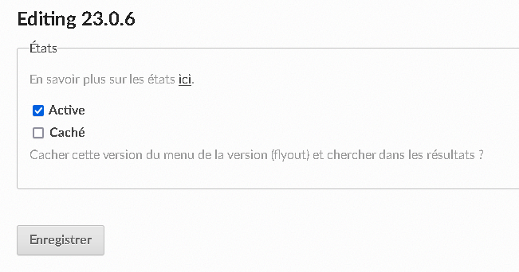
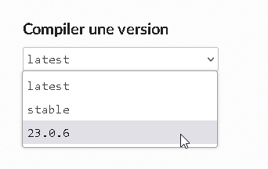

# Gérer des versions de la documentation

/!\ Procédure non validée ! A tester !

## Principe

Le principe est de faire correspondre 3 choses :

- un tag dans le dépôt de code du projet
- une version dans le fichier MkDocs déclarant les versions
- une version à compiler sur ReadTheDocs


## Déclarer une nouvelle version dans MkDocs

Éditer le fichier [docs/versions.json](docs/versions.json)

```
[
  {"version": "latest", "title": "latest", "aliases": ["latest"]},
  {"version": "version_test", "title": "version_test", "aliases": []}
]
```

Deviendra:

```
[
  {"version": "latest", "title": "latest", "aliases": ["latest"]},
  {"version": "nouvelle", "title": "nouvelleversion", "aliases": []},
  {"version": "version_test", "title": "version_test", "aliases": []}
]
```

Committer puis pousser vers le dépôt.


## Créer une nouvelle version

Aller sur [l'interface d'administration de ReadTheDocs](https://readthedocs.org/dashboard/).

Choisir le projet concerné.

Cliquer sur l'onglet "Versions".

Dans la zone de recherche, chercher la release ou le tag correspondant à la version puis cliquer sur "Filtrer les versions inactives".

Vérifier si le bon tag est filtré puis cliquer sur le bouton "Activer".



Sur la page suivante, confirmer l'activation de la version.



La version est ensuite disponible pour une compilation sur l'onglet "Aperçu".




## Vérifier

Aller sur la documentation en ligne et vérifier si le sélecteur de version est bien actif et opérationnel.

TODO : capture d'écran